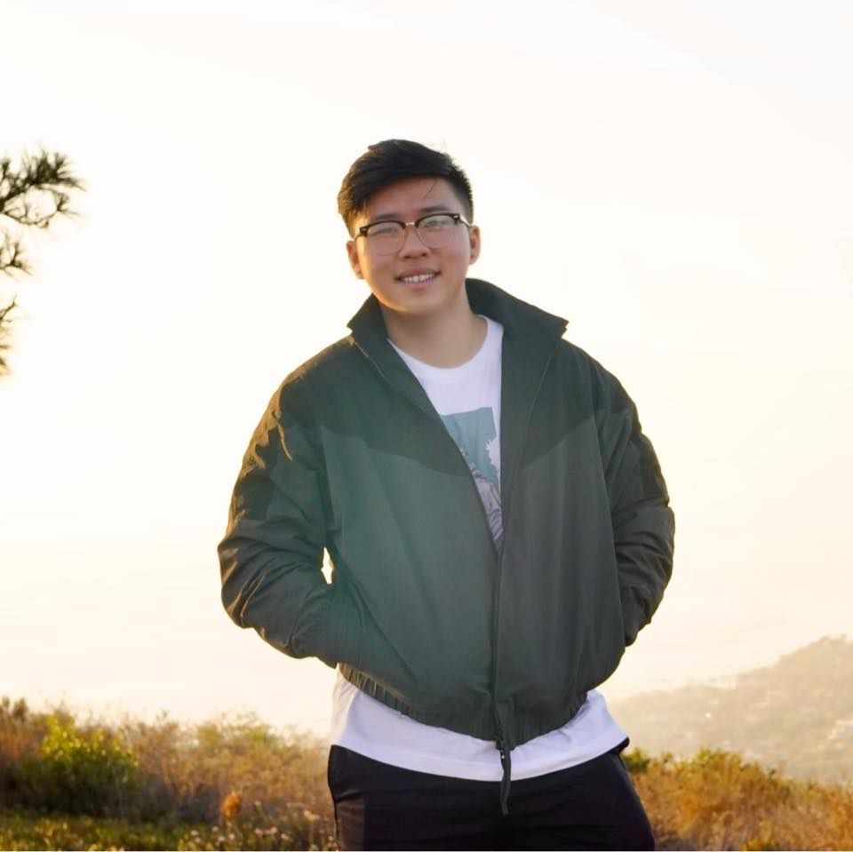

# Jason Win

##  About me
Hi! I'm Jason, a 3rd year computer science major at the University of California, San Diego and aspiring software engineer looking to explore my passion for technology through new experiences and learning. [Oops go back I don't want to learn more.](README.md)
## Hobbies
- Cars
- Basketball
- Eating good food
- Travelling
- Technology
- Spending time with family and friends
- ~~Coding~~
## Inspiration
**In the words of the late Kobe Bryant:**
> "But are you a different animal and the same beast?"
[RIP KOBE](https://www.youtube.com/watch?v=Ickn8iipxUc)

`System.out.println("Always debug with print statements.")`

**Me ~~following~~ the wise words of our CSE department:**
- [ ] Start early
- [ ] Start often

## Keys to Success
1. Save Money
2. Live Better
3. Walmart

### Thank you for coming to my TED Talk
Stay happy and healthy everyone :)

